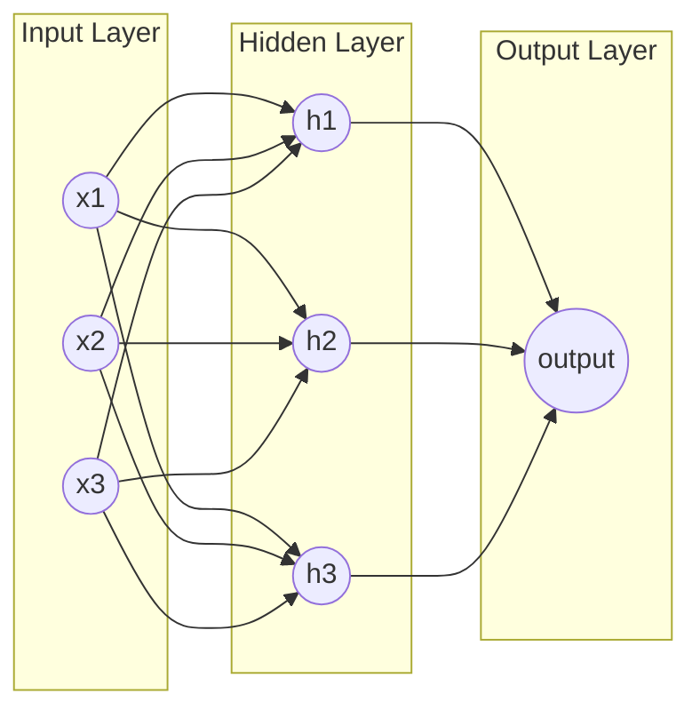
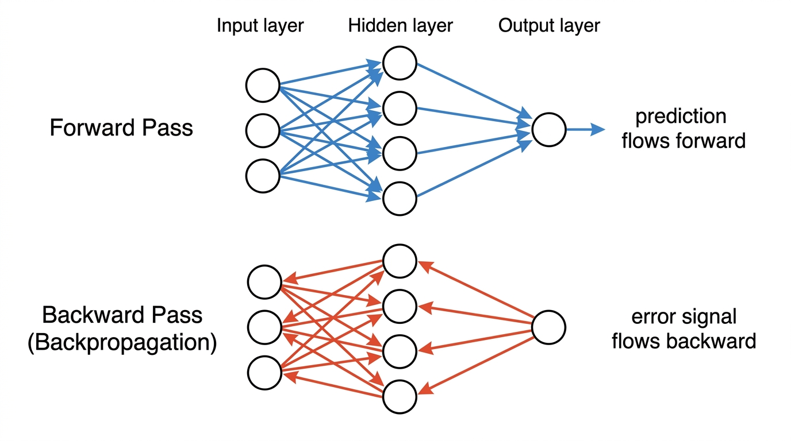

# 05: How Models Learn

Before sequence models make sense, one concept needs to be in place: how a neural network actually learns from data.

This chapter covers three things:

1. what a neural network is
2. what gradient descent is
3. what backpropagation is

These are not optional background. Every model from this point forward — RNNs, LSTMs, transformers — learns using these exact mechanisms.

---

## What a Neural Network Is

A neural network is a function that maps an input to an output by passing data through layers of connected nodes.

Each node takes in some numbers, multiplies them by weights, adds them up, and passes the result to the next layer.



The connections between nodes have **weights** — numbers that control how much influence one node has on the next.

For example, in a sentiment classifier:

- Input: the embedding vectors of each word in a sentence
- Hidden layer: internal representations the model builds
- Output: a single number (positive or negative)

At the start, all weights are random. The model knows nothing. It will make bad predictions.

Learning is the process of adjusting those weights so the predictions get better.

---

## What Gradient Descent Is

To improve the weights, the model needs two things:

1. a way to measure how wrong it is
2. a way to adjust the weights in the direction that makes it less wrong

**Measuring how wrong: the loss function**

After making a prediction, the model compares it to the correct answer. The gap between prediction and correct answer is the **loss**.

- predicted: 0.2 (slightly negative)
- correct: 1.0 (strongly positive)
- loss: large

The goal of training is to reduce loss across the entire dataset.

**Adjusting the weights: gradient descent**

Think of the loss as a landscape. The x-axis is a weight value. The y-axis is the resulting loss. The model is trying to find the lowest point.

```
Loss
  |
  |  .
  | / \
  |/   \       .
  |     \     / \
  |      \   /   \
  |       \_/     \___
  |         ↑
  |       minimum
  |
  +-------------------------> Weight value
```

At any point on that curve, the **gradient** tells you which direction the curve slopes upward. Moving in the opposite direction — downhill — reduces the loss.

The model makes a small adjustment to each weight in the downhill direction. Then it checks again. Then adjusts again. Over thousands of steps, the weights converge toward values that produce low loss.

This is **gradient descent**: repeatedly adjust weights in the direction that reduces loss.

**Learning rate**

Each step has a size — called the **learning rate**. Too large: the model overshoots the minimum and bounces around. Too small: training takes too long. Choosing the learning rate is one of the practical challenges of training neural networks.

---

## What Backpropagation Is

The network has many layers and thousands of weights. After computing the loss, the model needs to figure out: which weights were responsible for the error, and by how much?

This is what **backpropagation** does.

It works by applying the chain rule from calculus: starting from the loss at the output, it passes the error signal backward through the network layer by layer, computing the gradient for each weight.



- **Forward pass** (blue arrows): the input flows through each layer, and the network produces a prediction.
- **Backward pass** (red arrows): the error flows backward through each layer, and each weight gets a gradient — a signal telling it how to change.

Once every weight has a gradient, gradient descent takes one step.

This cycle — forward pass, compute loss, backward pass, update weights — repeats for every training example. Over millions of examples, the weights settle into values that make the model accurate.

---

## Why This Matters for Everything That Follows

Every model from here forward — RNNs, LSTMs, transformers, language models — learns using this same loop:

1. make a prediction (forward pass)
2. measure the error (loss)
3. propagate the error backward (backpropagation)
4. adjust weights (gradient descent)
5. repeat

The architectures change. The learning mechanism does not.

When ch04 said "the model adjusts all the numbers slightly based on the error" during Word2Vec training — that was this. Gradient descent and backpropagation, applied to embedding vectors.

When we say an RNN "learns" to connect "it" to "cat" — that is this. The model made wrong predictions, the error propagated back through every step of the sequence, and the weights were updated.

The next chapter covers what happens when you build that loop into a model that processes sequences one word at a time.
